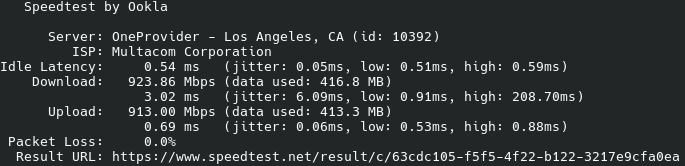
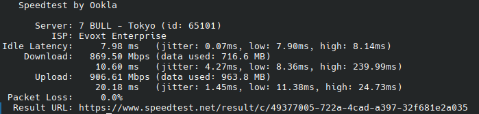

# These are some servers with special features.

## Los Angeles , California , USA (LAX) :

> Speedtest:
>
> [Download file from this server.](https://867678.xyz/projects/speedtest)
>
> 
>


Domain:
```
us-lax1.867678.xyz
```


IPv4:

```
74.48.125.113
```

IPv6:

```
2607:f130:0000:0153:0000:0000:ae12:43b5
```
```
2607:f130:0000:0153:0000:0000:d7fa:9ca5
```
```
2607:f130:0000:0153:0000:0000:f239:9af0
```

------

## Osaka , Kansai , Japan (OSA2):

> Speedtest:
>
> [Download file from this server](https://867678.xyz/projects/speedtest)
>
>

Domain:
```
jp-osa1.867678.xyz
```

IPv4:

```
64.176.62.7
```

IPv6:

```
2401:c080:3800:2342:5400:05ff:feb7:2e27
```

------


# Cloudflare free services.

## Speedtest URL :

> Cloudflare R2
>
> 
>

```
https://867678.xyz/projects/speedtest
```

------

# What can them do?
### Speedtest
#### HTTPS Download
>[HTTPS Test](https://867678.xyz/projects/speedtest)
#### Iperf3

> Test Download
```
iperf3 -c [IP/Domain] -R
```

>Test Upload
```
iperf3 -c [IP/Domain]
```
